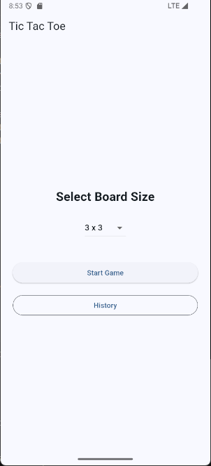
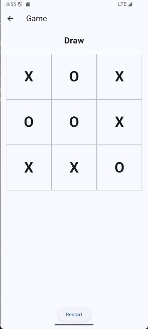
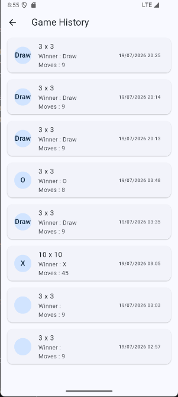
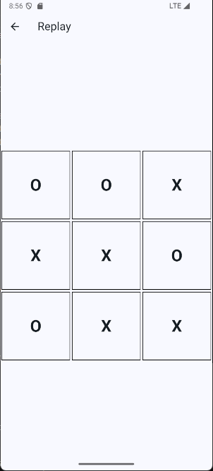
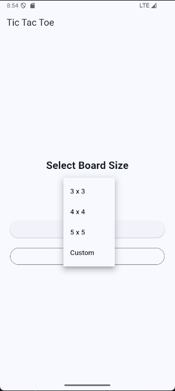

# 🎮 Tic Tac Toe AI

A Flutter Tic Tac Toe game with **Dynamic Board Sizes**, **AI Opponent**, **Game History**, and **Replay System** using **Firebase Firestore**.

---

## 📱 Screenshots

| Home                            | Game                            | History                            | Replay                            |
| ------------------------------- | ------------------------------- | ---------------------------------- | --------------------------------- |
|  |  |  |  |
|  |

---

# ✨ Features

- ✅ Dynamic board size (3×3, 4×4, 5×5, NxN)
- ✅ AI opponent
- ✅ Minimax algorithm for 3×3 boards
- ✅ Heuristic algorithm for larger boards
- ✅ Winner & Draw detection
- ✅ Game history
- ✅ Replay previous games
- ✅ Firebase Firestore integration
- ✅ Clean Architecture using Provider

---

# 🛠 Tech Stack

| Technology         | Usage                |
| ------------------ | -------------------- |
| Flutter            | UI Framework         |
| Dart               | Programming Language |
| Provider           | State Management     |
| Firebase Firestore | Cloud Database       |
| Material Design    | User Interface       |

---

# 📂 Project Structure

```text
lib/
├── models/
├── providers/
├── screens/
├── services/
├── utils/
├── widgets/
└── main.dart
```

---

# 🧠 AI Algorithm

## 3×3 Board

The AI uses the **Minimax Algorithm**.

Minimax evaluates every possible move and always selects the optimal move.

As a result:

- The AI never loses.
- The best outcome for the player is a draw.

---

## NxN Board

For larger boards, Minimax becomes computationally expensive.

Therefore, the project uses a **Heuristic Algorithm** to:

- Evaluate possible moves
- Prioritize winning opportunities
- Block opponent moves
- Maintain fast response time

---

# ☁ Firebase Structure

```text
games
│
├── gameId
│   ├── boardSize
│   ├── winner
│   ├── totalMoves
│   ├── createdAt
│   │
│   └── moves
│       ├── moveId
│       │   ├── row
│       │   ├── col
│       │   ├── player
│       │   └── moveNumber
```

---

# ▶ Replay System

Each completed game stores every move in Firestore.

The Replay feature reconstructs the game by loading moves in order and displaying them sequentially with animation.

---

# 🚀 Installation

```bash
git clone https://github.com/chutiw02/tic_tac_toe.git

cd tic_tac_toe

flutter pub get

flutter run
```

---

# 📌 Future Improvements

- Online Multiplayer
- Difficulty Selection
- Sound Effects
- Game Statistics
- Leaderboard
- Dark Mode

---

# 👨‍💻 Author

**Chutiphon Phuengkhum**

Flutter Developer

GitHub: https://github.com/chutiw02
